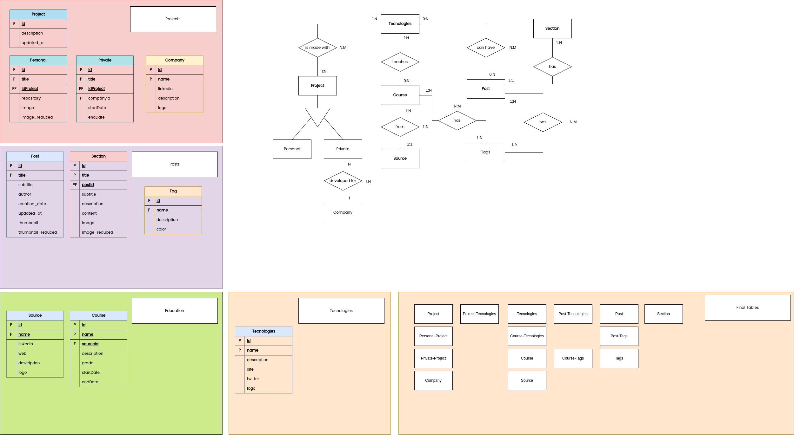
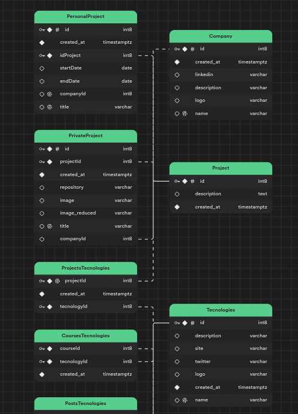
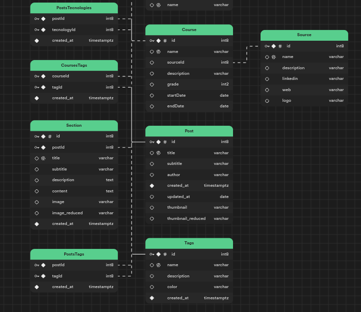

# Project Initialization & planification

This project is about developing a personal Portfolio, to further enhance my Web Dev abilities, expand my brand and have something to show of my personal projects and private ones in a professional way.

    
 Expand to see the project overview diagram

    <picture>
        
    </picture>

## Database initialization and development

The project leverages the power of supabase, a powerfull cloud Postgres manager, we don't have to develop the whole infrastructure and we can focus on what's really important without having to worry about docker, kubernetes or any infraestructure necessary to deploy our main DB.

    
 Database E/R diagram 

    <picture>
        
    </picture>

    
 Supabase final diagram 

    <picture>
        
    </picture>
    <picture>
        
    </picture>

> The main objective of this DB architecture is to simplify the data enough to make little queries to render the data recursively and conditionally.

## Main Services Architecture

### Routes

I'm going to define the main routes for both Web & API endpoints.

#### Web Routes

* / - Will be the main entrypoint of the Web page.
* /blog - Will be the entrypoint for the blog page.
* /contact - Will be the entrypoint for the contact page.

#### API Endpoints

#### Go API Endpoints

* /api - Will be the main entrypoint of the application.
  * /api/image - Will be the main entrypoint for the image processing part of the application.
